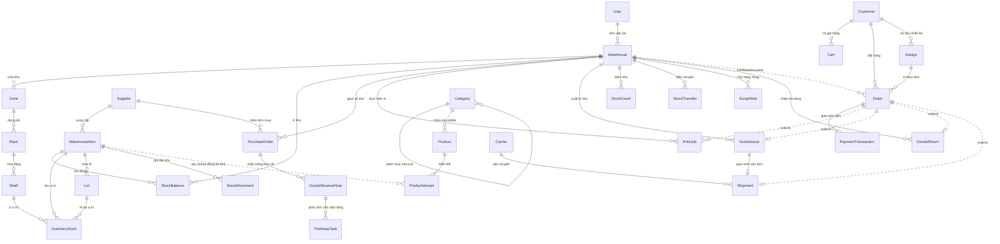

# Phân Tích Toàn Diện & Hệ Thống Cơ Sở Dữ Liệu WMS-ECOM

Tài liệu này phân tích chi tiết thiết kế cơ sở dữ liệu hệ thống tích hợp **WMS (Warehouse Management System)** và **Ecommerce (Ecom)** gồm **45 bảng** và **29 enums** được chia làm 2 cơ sở dữ liệu logic hoạt động trên cùng một MongoDB Cluster.

---

## I. Tổng Quan Kiến Trúc Cơ Sở Dữ Liệu

Hệ thống được thiết kế theo mô hình **Service-Oriented** với dữ liệu được phân chia rạch ròi thành 2 database logic độc lập nhằm đảm bảo tính cô lập và hiệu năng:

```
                  [ MongoDB Cluster ]
                     /           \
     wms_db (Warehouse)          ecom_db (Ecommerce)
     - warehouse                 - catalog
     - supplier                  - order
     - shipping                  - auth-ecom
     - auth-wms
         ▲                             ▲
         └─────── LIÊN KẾT DUY NHẤT ───┘
               - SKU (Đồng bộ tồn)
               - ID tham chiếu xuyên app (orderId, printJobId...)
               - Giao tiếp qua Event (BullMQ + Redis)
```

> [!IMPORTANT]
> **Quy tắc cô lập tuyệt đối:** Không bao giờ thực hiện các truy vấn đọc/ghi chéo (cross-database query/join) trực tiếp giữa các collection của WMS và Ecommerce ở tầng logic ứng dụng. Mọi giao tiếp và đồng bộ đều thông qua hàng đợi sự kiện bất đồng bộ (BullMQ + Redis) hoặc thông qua việc lưu trữ bản sao dữ liệu tại thời điểm phát sinh giao dịch (Snapshot).

---

## II. 5 Khái Niệm Cốt Lõi Xương Sống

Mọi quyết định thiết kế trong 45 bảng đều được xây dựng dựa trên 5 nguyên tắc nền tảng sau (Xem chi tiết tại [00 — 5 khái niệm lõi](00-khai-niem-loi.md)):

### 1. Tách biệt góc nhìn (WMS vs Ecom) qua SKU
Cùng một "ly nhựa 500ml" nhưng góc nhìn và thông tin lưu trữ ở hai phía hoàn toàn khác nhau. Chúng chỉ gặp nhau ở một từ khóa duy nhất: `sku`.
*   **WMS (`wms_db`)**: Tập trung vào mặt vật lý (kích thước, loại hàng, vị trí chính xác trên kệ, số lô, hạn sử dụng). *Không có trường giá.*
*   **Ecom (`ecom_db`)**: Tập trung vào khía cạnh marketing/thương mại (tên hiển thị, mô tả sản phẩm, hình ảnh đẹp, giá bán lẻ, cấu trúc danh mục, SEO). *Không cần biết hàng nằm ở shelf nào.*

### 2. Quản lý tồn kho hai lớp (Two-Layer Stock)
Đây là thiết kế tối quan trọng giải quyết bài toán: vừa hiển thị tồn chính xác trên web cực nhanh, vừa chỉ đường cho nhân viên kho lấy hàng chuẩn xác (Xem chi tiết tại [02 — Hàng hóa & tồn kho 2 lớp](02-hang-hoa-va-ton-kho.md)):

$$\text{StockBalances.available} = \text{onHand} - \text{reserved} - \text{expired}$$

*   **Lớp 1 (Tổng quan - `stock_balances`)**: Lưu tổng lượng tồn theo SKU và Kho. Dùng để chống bán vượt (oversell) và đồng bộ sang Ecommerce.
*   **Lớp 2 (Chi tiết vị trí - `inventory_stocks`)**: Lưu chi tiết sản phẩm nằm ở vị trí nào (shelf nào), thuộc lô nào (lot nào), số lượng bao nhiêu.
*   **Đồng bộ**: Cả hai lớp phải được cập nhật đồng thời trong một transaction. Tổng số lượng ở lớp 2 luôn bằng `onHand` của lớp 1.

### 3. Sổ cái bất biến (Append-Only Ledger)
Hệ thống sử dụng hai bảng đặc biệt hoạt động theo cơ chế **chỉ thêm dòng mới, không sửa, không xóa**:
*   `stock_movements`: Ghi lại mọi biến động nhập/xuất/điều chuyển vật lý của kho (thẻ kho).
*   `payment_transactions`: Ghi lại mọi giao dịch tài chính (thu tiền online, thu COD, hoàn tiền).

> [!NOTE]
> Các trường trạng thái như `Order.paymentStatus` hay `StockBalances.onHand` chỉ là **dữ liệu cache dẫn xuất** được tính toán và tối ưu hóa từ hai sổ cái này. Nếu có sai sót, hệ thống bắt buộc phải ghi dòng đảo (bút toán điều chỉnh) để đối soát dòng tiền và dòng hàng một cách minh bạch.

### 4. Đóng băng lịch sử (Snapshotting)
Để tránh việc thay đổi dữ liệu danh mục (như cập nhật giá bán, đổi tên sản phẩm, xóa địa chỉ của khách hàng) làm ảnh hưởng hoặc làm méo mó thông tin của các đơn hàng đã hoàn tất trong quá khứ, hệ thống thực hiện sao chép cứng dữ liệu tại thời điểm giao dịch:
*   `order_items`: Lưu bản sao cứng của `name` và `unitPrice`.
*   `orders.shippingAddress`: Lưu bản sao địa chỉ giao hàng tại thời điểm đặt.
*   `shipments.recipient`: Lưu bản sao thông tin người nhận `{name, phone, address}` được truyền qua event để WMS đóng gói mà không cần đọc database Ecommerce.

### 5. Đơn hàng với 3 trục trạng thái độc lập
Thay vì dùng 1 trạng thái duy nhất dẫn đến xung đột logic khi có nhiều hình thức thanh toán (COD vs Online) và hình thức chuẩn bị hàng (Hàng có sẵn vs In theo yêu cầu), hệ thống tách biệt thành 3 trục độc lập:
1.  **`orderStatus`** (Vòng đời pháp lý đơn): `PLACED` $\rightarrow$ `CONFIRMED` $\rightarrow$ `CLOSED` / `CANCELLED`.
2.  **`paymentStatus`** (Dòng tiền): `UNPAID` $\rightarrow$ `PAID` $\rightarrow$ `REFUND_PENDING` $\rightarrow$ `REFUNDED`.
3.  **`fulfillmentStatus`** (Vận hành kho & giao nhận): `NONE` $\rightarrow$ `AWAITING_PRINT` (Chờ in) $\rightarrow$ `READY_TO_PICK` $\rightarrow$ `ISSUED` $\rightarrow$ `SHIPPED` $\rightarrow$ `DELIVERED` / `RETURNED`.

---

## III. Sơ Đồ Quan Hệ Concept (ERD Concept)

Sơ đồ thể hiện liên kết giữa các bảng chính. Đường nét liền chỉ quan hệ trong cùng một database, đường **nét đứt** chỉ liên kết **xuyên database (Cross-App)**.



---

## IV. Phân Tích Chi Tiết Từng Phân Hệ Dữ Liệu

### 1. Phân Hệ WMS (Quản lý kho nội bộ - `wms_db`)

#### A. Cấu trúc kho vật lý (Warehouse Structure)
*   **Warehouses**: Quản lý thông tin kho. Phân loại `CENTRAL` (Kho trung tâm - ưu tiên điều phối hàng) và `SUB` (Kho phụ). (Xem [01 — Kho & vị trí](01-kho-va-vi-tri.md))
*   **Zones $\rightarrow$ Racks $\rightarrow$ Shelves**: Tổ chức không gian lưu trữ theo cấu trúc hình cây.
    *   `shelves` là ô/tầng kệ cụ thể và có lưu mã barcode (`code`). Đây là điểm quét thực tế của nhân viên kho.
    *   Trường `isStaging` trong `shelves` đánh dấu đây là khu vực đệm nhận hàng (hàng vừa nhập từ xe tải, chưa xếp lên kệ).

#### B. Hàng hóa, Tồn kho & Lô hàng (Inventory & Lot)
*   **Warehouse_items**: Định nghĩa hàng hóa trong kho. Tồn kho và quy trình vận hành dựa hoàn toàn vào đơn vị cơ sở (`unit`). Trường `altUnits` hỗ trợ quy đổi đơn vị (ví dụ: 1 thùng = 50 cái).
*   **Lots**: Quản lý lô sản xuất và ngày hết hạn (`expiryDate`). Hệ thống chạy nghiệp vụ xuất hàng theo phương pháp **FEFO** (First Expired, First Out - lô cận hạn xuất trước).
*   **Stock_balances (Lớp 1)**: Quản lý lượng hàng khả dụng để bán:
    $$\text{available} = \text{onHand} - \text{reserved} - \text{expired}$$
*   **Inventory_stocks (Lớp 2)**: Quản lý hàng hóa cụ thể theo từng shelf và từng lot.
*   **Stock_movements**: Sổ cái ghi lại mọi lịch sử biến động số lượng vật lý kèm tham chiếu chứng từ (`refId`, `refType`).

#### C. Quy trình Nhập kho (Inbound Process)
*   **Purchase_orders (+ items)**: Đơn đặt hàng NCC. (Xem [03 — Nhập kho](03-nhap-kho.md))
*   **Goods_receive_notes (+ items)**: Phiếu thực nhận hàng tại kho. Khi chuyển trạng thái sang `APPROVED`, hàng được ghi nhận vào kho tại khu vực đệm: `onHand` tăng, ghi sổ `stock_movements` với type `RECEIVE`, vị trí chỉ định là `shelf` có `isStaging = true`.
*   **Putaway_tasks (+ items)**: Phiếu chỉ định xếp hàng từ khu đệm (`isStaging = true`) lên các kệ hàng thật (`isStaging = false`). Khi hoàn tất, hệ thống ghi 2 dòng movement đối ứng:
    *   `PUTAWAY -` (trừ tại khu staging)
    *   `PUTAWAY +` (cộng tại shelf thật)
    *   *Tổng số lượng `onHand` của kho không đổi nhưng tồn chi tiết tại các shelf được cập nhật chuẩn xác.*

#### D. Lệnh in ly Make-To-Order (Print Jobs)
Hệ thống hỗ trợ in ấn thiết kế riêng theo từng đơn hàng (`fulfillmentType = CUSTOM_PRINT`):
*   **Print_jobs (+ items)**: Theo dõi lệnh in. Đầu vào (`inputItemId`) là ly trắng (`CUP_BLANK`), đầu ra (`outputItemId`) là ly đã in thiết kế riêng (`CUP_PRINTED` - được gán SKU riêng theo mẫu thiết kế). (Xem [04 — In ly](04-in-ly.md))
*   **Logic chuyển đổi tồn cực kỳ tinh tế**:
    1.  Tạo lệnh in: Tồn ly trắng bị giữ lại: `CUP_BLANK.reserved += quantity`.
    2.  Bắt đầu in: Tiêu thụ thực tế ly trắng: `CUP_BLANK.onHand -= quantity` và `CUP_BLANK.reserved -= quantity`. Ghi movement `PRINT_CONSUME -`.
    3.  In xong: Tạo ra ly in mới và lập tức giữ riêng cho đơn hàng đó: `CUP_PRINTED.onHand += quantity` và `CUP_PRINTED.reserved += quantity`. Ghi movement `PRINT_OUTPUT +`.
    4.  Xuất kho giao hàng: Xuất ly đã in đi: `CUP_PRINTED.onHand -= quantity` và `CUP_PRINTED.reserved -= quantity`. Ghi movement `ISSUE -`.

#### E. Xuất kho & Nghiệp vụ nội bộ (Outbound & Internal)
*   **Goods_issues (+ items)**: Phiếu xuất hàng giao cho khách. Giảm `onHand` và `reserved` của kho, ghi movement `ISSUE -`. (Xem [05 — Xuất kho & nội bộ](05-xuat-kho-va-noi-bo.md))
*   **Stock_counts (+ items)**: Phiếu kiểm kê kho. Khi phê duyệt, ghi nhận chênh lệch qua movement `ADJUST ±delta` để đồng bộ lại số tồn hệ thống khớp thực tế.
*   **Stock_transfers (+ items)**: Phiếu chuyển kho nội bộ. Sinh 2 bút toán đối ứng `TRANSFER_OUT -` tại kho gửi và `TRANSFER_IN +` tại kho nhận.
*   **Scrap_notes (+ items)**: Phiếu thanh lý hàng hỏng/hết hạn. Giảm `onHand` (và giảm `expired` nếu là hàng hết hạn), ghi movement `SCRAP -`.
*   **Goods_returns (+ items)**: Phiếu nhận hàng hoàn trả từ khách hàng. Nếu kiểm tra hàng còn tốt (`condition = GOOD`), nhập lại kệ bán và tăng `onHand`, bắn event đồng bộ tồn lên Ecommerce. Nếu hỏng (`DAMAGED`), đưa sang phân khu chờ hủy (Scrap).

#### F. Phân hệ phụ trợ (Supplier, Shipping & Staff Auth)
*   **Suppliers & Supplier_items**: Danh mục NCC và bảng giá nhập của từng SKU. Hiện tại thiết kế ràng buộc 1 SKU chỉ có 1 NCC chính (`itemId` là unique trong `supplier_items`). (Xem [06 — Supplier](06-supplier.md))
*   **Carriers & Shipments**: Quản lý đơn vị vận chuyển và hành trình giao đơn hàng. 1 phiếu xuất kho (`goods_issue`) đi kèm đúng 1 vận đơn (`shipment`). (Xem [07 — Shipping](07-shipping.md))
*   **Users & User_refresh_tokens**: Quản lý nhân viên kho và phân quyền hành động (`ADMIN`, `MANAGER`, `RECEIVER`, `PICKER`, `PRINTER`, `COUNTER`). (Xem [08 — Auth-WMS](08-auth-wms.md))

---

### 2. Phân Hệ Ecommerce (Kênh bán hàng - `ecom_db`)

#### A. Catalog (Danh mục & Biến thể)
*   **Categories**: Danh mục sản phẩm tổ chức dạng cây phân cấp nhờ liên kết tự tham chiếu (`parentId`). (Xem [09 — Catalog](09-catalog.md))
*   **Products & Product_variants**:
    *   `products` chứa thông tin hình ảnh, mô tả chung.
    *   `product_variants` chứa thông tin chi tiết từng phiên bản bán (kích thước, màu sắc), giá bán lẻ (`price`) và **bản copy số lượng tồn khả dụng** (`availableQty`).
    *   `availableQty` được đồng bộ bất đồng bộ từ trường `available` của WMS để Ecommerce hiển thị nhanh chóng trên giao diện web. Tuy nhiên, đây không phải nguồn chân lý cuối cùng khi chốt đơn.
*   **Designs**: Thư viện chứa các file thiết kế do khách hàng tự upload để in ly theo yêu cầu.

#### B. Giỏ hàng & Đơn hàng (Cart & Order)
*   **Carts (+ items)**: Giỏ hàng tạm thời của khách hàng. Chưa thực hiện giữ tồn kho. (Xem [10 — Order](10-order.md))
*   **Orders (+ items)**: Đơn đặt hàng chính thức. Lưu thông tin thanh toán, địa chỉ nhận hàng và kho thực hiện đóng gói (`fulfillWarehouseId`).
*   **Payment_transactions**: Sổ cái ghi nhận lịch sử thanh toán (Online, COD, Refund).

#### C. Khách hàng (Customer Auth)
*   **Customers**: Danh bạ thông tin khách hàng. Sổ địa chỉ nhận hàng (`addresses`) được nhúng trực tiếp (embedded) vào tài liệu customer để tối ưu hóa hiệu năng truy vấn. (Xem [11 — Auth-Ecom](11-auth-ecom.md))
*   **Customer_refresh_tokens & Customer_auth_tokens**: Quản lý phiên đăng nhập và các token một lần (xác thực email, đặt lại mật khẩu).

---

## V. Phân Tích Luồng Dữ Liệu End-To-End (Vòng Đời Đơn Hàng)

Dưới đây là sơ đồ chi tiết mô tả cách dữ liệu thay đổi trên các bảng thuộc cả 2 DB trong suốt vòng đời của một đơn hàng (từ nhập kho cho đến khi giao thành công hoặc hoàn trả) (Xem thêm tại [12 — Luồng end-to-end](12-luong-end-to-end.md)):

```
       KÊNH ECOMMERCE (ecom_db)                        HỆ THỐNG KHO WMS (wms_db)
       ────────────────────────                        ─────────────────────────
P0: Nhập hàng (Inbound)
                                                 [suppliers] [purchase_orders]
                                                                  │
                                                                  ▼
                                                     [goods_receive_notes]
                                                 - Tạo Lot [lots] mới
                                                 - Tăng [stock_balances.onHand] (staging)
                                                 - Ghi [stock_movements] (RECEIVE +)
                                                                  │
                                                                  ▼
                                                      [putaway_tasks] (Xếp kệ)
                                                 - Chuyển hàng từ staging lên shelf thật
                                                 - Ghi [stock_movements] (PUTAWAY -/+)
                                                 - Tạo [inventory_stocks] chi tiết vị trí
                                                                  │
                                        (Đồng bộ tồn)             ▼
P1: Duyệt Web     [product_variants.availableQty] ◄─── [stock_balances.available] (Nguồn thật)

P2: Bỏ giỏ        [carts] & [cart_items] (Chưa giữ tồn, chỉ đọc availableQty kiểm tra)

P3: Checkout      [orders] & [order_items] (Snapshot)  ┌─► [stock_balances] (Giữ tồn)
                  (Transaction atomic xuyên 2 DB)  ────┼   - Cộng reserved += qty
                  [product_variants.availableQty] ─────┘   (Chống bán vượt - Oversell)

P4: Thanh toán    [payment_transactions] (CHARGE)
                  - Đối với đơn ly in (CUSTOM_PRINT)
                    Phát sự kiện in ───────────────────► [print_jobs] & [print_job_items]
                                                         - Tiêu thụ ly trắng (CUP_BLANK)
                                                           [stock_movements] (PRINT_CONSUME -)
                                                         - In xong ra ly in (CUP_PRINTED)
                                                           [stock_movements] (PRINT_OUTPUT +)
                                                           [stock_balances.reserved] giữ ly in
                                                         - Cập nhật [order_items.printJobId]

P5: Xuất kho      Phát sự kiện yêu cầu đóng hàng ──────► [goods_issues] & [goods_issue_items]
                                                         - Picker nhặt hàng theo lô (FEFO)
                                                         - Trừ vật lý: onHand -=, reserved -=
                                                         - Ghi [stock_movements] (ISSUE -)
                                                         - Tự động sinh vận đơn [shipments]

P6: Giao vận      Nhận cập nhật từ đơn vị vận chuyển ◄─── [shipments] (PENDING -> IN_TRANSIT)
                  - fulfillmentStatus = SHIPPED
                  - Giao thành công (DELIVERED)
                    fulfillmentStatus = DELIVERED
                    orderStatus = CLOSED
                    (Nếu COD: Ghi nhận tiền thu hộ) ◄─── Ghi [payment_transactions] (COD_COLLECT)

P7: Hoàn trả      (Nếu khách trả hàng - RMA) ──────────► [goods_returns] & [goods_return_items]
                  - Trả hàng tốt (GOOD)  ──────────────► Nhập lại kệ: [stock_balances.onHand] +=
                                                         Ghi [stock_movements] (RECEIVE +)
                                                         Đồng bộ tồn lại lên [product_variants]
                  - Trả hàng hỏng (DAMAGED) ───────────► Đẩy sang hủy: [scrap_notes]
                                                         Ghi [stock_movements] (SCRAP -)
```

---

## VI. Các Điểm Bất Biến & Kiểm Tra Tính Toàn Vẹn (Invariants)

Để hệ thống vận hành trơn tru và không xảy ra các lỗi nghiêm trọng (như lệch tồn kho, lệch tiền, hoặc bán vượt số lượng thực tế), cơ sở dữ liệu phải luôn thỏa mãn các điều kiện bất biến sau:

| STT | Ràng Buộc Bất Biến | Mô Tả Kỹ Thuật |
|---|---|---|
| **1** | **Khớp tồn hai lớp** | Với mỗi SKU ở một kho nhất định, giá trị `stock_balances.onHand` phải luôn bằng tổng số lượng tồn chi tiết tại các vị trí kệ thuộc kho đó: `Σ inventory_stocks.quantity`. |
| **2** | **Khớp sổ cái thẻ kho** | Giá trị `stock_balances.onHand` hiện tại phải bằng tổng tích lũy lịch sử các dòng biến động trong thẻ kho: `Σ stock_movements.quantity`. |
| **3** | **Không âm tồn khả dụng** | Công thức tính: $\text{available} = \text{onHand} - \text{reserved} - \text{expired}$. Giá trị này phải luôn $\ge 0$. |
| **4** | **Một đơn - Một kho - Một kiện** | Một đơn hàng (`order`) chỉ được xử lý giữ tồn tại duy nhất một kho (`fulfillWarehouseId`) và đi kèm với đúng một vận đơn vận chuyển (`shipment`). Hệ thống chưa hỗ trợ tách đơn giao từ nhiều kho. |
| **5** | **Khớp sổ cái tài chính** | Trạng thái thanh toán của đơn hàng (`order.paymentStatus`) phải là kết quả tính toán trực tiếp từ tổng số tiền thu/chi thành công ghi nhận tại sổ cái: `payment_transactions` (CHARGE, REFUND, COD_COLLECT). |
| **6** | **Chống bán vượt lúc đặt** | Việc kiểm tra tồn khả dụng thực tế và cộng dồn lượng giữ hàng (`reserved += quantity`) phải được bọc trong một **Transaction duy nhất** khóa tài liệu (document-level lock) trên `wms_db.stock_balances`. |
