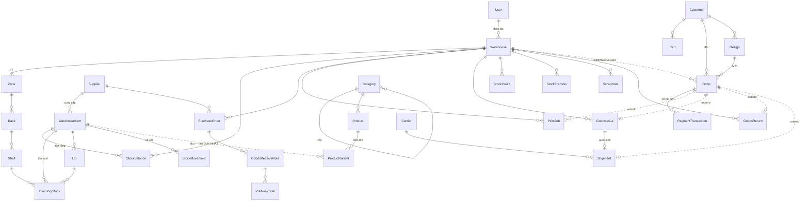

# ERD mức concept — Tổng quan thực thể WMS-ECOM (1 slide)

> Bản **concept** (cao): chỉ **entity + quan hệ**, lược bỏ field và các bảng `*Item` chi tiết (gộp vào entity cha). Dùng cho slide tổng quan. Bản đầy đủ (có field): [erd.md](erd.md).

**Quy ước:** nét liền = quan hệ trong cùng app; **nét đứt** = liên kết **xuyên 2 app** (chỉ qua `sku`/`orderId`, không đọc chéo, giao tiếp qua event).

## Đọc theo cụm

| App / DB | Cụm | Entity (đã gộp `*Item`) |
|---|---|---|
| **WMS** `wms_db` | Cấu trúc kho | `Warehouse → Zone → Rack → Shelf` |
| | Hàng & tồn | `WarehouseItem` · `StockBalance` (tổng) · `InventoryStock` (vị trí) · `Lot` · `StockMovement` (sổ cái) |
| | Nhập | `Supplier → PurchaseOrder → GoodsReceiveNote → PutAwayTask` |
| | Xuất / nội bộ | `PrintJob` · `GoodsIssue` · `StockCount` · `StockTransfer` · `ScrapNote` · `GoodsReturn` |
| | Giao hàng | `Carrier · Shipment` |
| | Nhân sự | `User` |
| **Ecommerce** `ecom_db` | Catalog | `Category → Product → ProductVariant` · `Design` |
| | Đơn | `Customer → Cart` · `Customer → Order → PaymentTransaction` |

> **3 cây cầu xuyên app (nét đứt):** `WarehouseItem.sku ⟷ ProductVariant.sku` (đồng bộ tồn) · `Order ⟷ PrintJob/GoodsIssue/GoodsReturn/Shipment` qua `orderId` · `Order.fulfillWarehouseId ⟷ Warehouse`. Tất cả qua **event (BullMQ + Redis)**, không đọc chéo collection.
