# ERD — Sơ đồ thực thể quan hệ toàn hệ WMS-ECOM

> Trạng thái: 🔄 Đang phân tích. Sinh từ các `data-model.md` của 7 module. Nguồn định danh chuẩn: [data-ownership.md](data-ownership.md).

**Quy ước đọc sơ đồ:**

- **Nét liền** `||--o{` = quan hệ trong **cùng một app/DB** (khóa ngoại `ObjectId` thật).
- **Nét đứt** `||..o{` = liên kết **xuyên 2 app** — chỉ qua `sku` hoặc id tham chiếu (`orderId`/`printJobId`/`fulfillWarehouseId`), **không đọc chéo collection** (xem [data-ownership](data-ownership.md)).
- 2 logical DB: **`wms_db`** (WMS — warehouse / supplier / shipping / auth-wms) và **`ecom_db`** (Ecommerce — catalog / order / auth-ecom).

```mermaid
erDiagram
    %% ===================== WMS — wms_db =====================

    %% --- Cấu trúc kho ---
    Warehouse ||--o{ Zone : "chứa"
    Zone ||--o{ Rack : "chứa"
    Rack ||--o{ Shelf : "chứa"

    %% --- Tồn kho 2 lớp ---
    WarehouseItem ||--o{ StockBalance : "lớp 1 (tổng)"
    Warehouse ||--o{ StockBalance : ""
    WarehouseItem ||--o{ InventoryStock : "lớp 2 (vị trí)"
    Warehouse ||--o{ InventoryStock : ""
    Shelf ||--o{ InventoryStock : ""
    Lot ||--o{ InventoryStock : ""
    WarehouseItem ||--o{ Lot : "lô (isPerishable)"
    WarehouseItem ||--o{ StockMovement : "sổ cái"
    Warehouse ||--o{ StockMovement : ""
    Shelf ||--o{ StockMovement : ""

    %% --- Mua hàng / nhập kho ---
    Supplier ||--o{ PurchaseOrder : "đặt hàng"
    Warehouse ||--o{ PurchaseOrder : ""
    PurchaseOrder ||--o{ PurchaseOrderItem : ""
    WarehouseItem ||--o{ PurchaseOrderItem : ""
    PurchaseOrder ||--o{ GoodsReceiveNote : "GRN"
    Warehouse ||--o{ GoodsReceiveNote : ""
    GoodsReceiveNote ||--o{ GoodsReceiveItem : ""
    WarehouseItem ||--o{ GoodsReceiveItem : ""
    GoodsReceiveNote ||--o{ PutAwayTask : "sắp xếp"
    PutAwayTask ||--o{ PutAwayItem : ""
    WarehouseItem ||--o{ PutAwayItem : ""
    Shelf ||--o{ PutAwayItem : ""

    %% --- In ly (make-to-order) ---
    Warehouse ||--o{ PrintJob : ""
    PrintJob ||--o{ PrintJobItem : ""
    WarehouseItem ||--o{ PrintJobItem : "blank→printed"

    %% --- Xuất kho / kiểm / chuyển / hủy / hoàn ---
    Warehouse ||--o{ GoodsIssue : "xuất"
    GoodsIssue ||--o{ GoodsIssueItem : ""
    WarehouseItem ||--o{ GoodsIssueItem : ""
    Warehouse ||--o{ StockCount : "kiểm kho"
    Zone ||--o{ StockCount : ""
    StockCount ||--o{ StockCountItem : ""
    WarehouseItem ||--o{ StockCountItem : ""
    StockTransfer ||--o{ StockTransferItem : "chuyển kho"
    WarehouseItem ||--o{ StockTransferItem : ""
    Warehouse ||--o{ ScrapNote : "hủy hàng"
    ScrapNote ||--o{ ScrapNoteItem : ""
    WarehouseItem ||--o{ ScrapNoteItem : ""
    Warehouse ||--o{ GoodsReturn : "hoàn (RMA)"
    GoodsReturn ||--o{ GoodsReturnItem : ""
    WarehouseItem ||--o{ GoodsReturnItem : ""

    %% --- Supplier ---
    Supplier ||--o{ SupplierItem : "báo giá"
    WarehouseItem ||--o| SupplierItem : "1 SKU↔1 NCC chính"

    %% --- Shipping ---
    Carrier ||--o{ Shipment : "hãng VC"
    GoodsIssue ||--o| Shipment : "auto-sinh"
    Warehouse ||--o{ Shipment : ""

    %% --- Auth-WMS ---
    User ||--o{ UserRefreshToken : ""

    %% ===================== Ecommerce — ecom_db =====================

    %% --- Catalog ---
    Category ||--o{ Category : "cây (parentId)"
    Category ||--o{ Product : ""
    Product ||--o{ ProductVariant : "biến thể"
    Customer ||--o{ Design : "thư viện design"

    %% --- Order ---
    Customer ||--o{ Cart : ""
    Cart ||--o{ CartItem : ""
    Customer ||--o{ Order : "đặt"
    Order ||--o{ OrderItem : ""
    Order ||--o{ PaymentTransaction : "sổ cái tiền"
    Design ||--o{ CartItem : "ly-in"
    Design ||--o{ OrderItem : "ly-in"

    %% --- Auth-Ecom ---
    Customer ||--o{ CustomerRefreshToken : ""
    Customer ||--o{ CustomerAuthToken : ""

    %% ===================== Liên kết XUYÊN 2 APP (nét đứt) =====================
    WarehouseItem ||..o{ ProductVariant : "sku (link DUY NHẤT 2 app)"
    Warehouse ||..o{ Order : "fulfillWarehouseId"
    Order ||..o{ PrintJob : "orderId"
    Order ||..o| GoodsIssue : "orderId"
    Order ||..o| GoodsReturn : "orderId"
    Order ||..o| Shipment : "orderId"
    PrintJob ||..o{ OrderItem : "printJobId"

    %% ===================== Định nghĩa thực thể =====================

    %% ---------- WMS: cấu trúc kho ----------
    Warehouse {
        ObjectId id PK
        String name
        Enum type "CENTRAL / SUB"
        Boolean isActive
    }
    Zone {
        ObjectId id PK
        ObjectId warehouseId FK
        String code
    }
    Rack {
        ObjectId id PK
        ObjectId zoneId FK
        String code
    }
    Shelf {
        ObjectId id PK
        ObjectId rackId FK
        String code "barcode vị trí"
        Boolean isStaging
    }

    %% ---------- WMS: hàng hóa & tồn ----------
    WarehouseItem {
        ObjectId id PK
        String sku UK "liên kết Ecommerce"
        String barcode
        Enum type "MATERIAL/CUP_BLANK/CUP_PRINTED/PACKAGING"
        String unit "đơn vị cơ sở"
        Boolean isPerishable
    }
    StockBalance {
        ObjectId id PK
        ObjectId itemId FK
        ObjectId warehouseId FK
        Number onHand
        Number reserved
        Number expired
        Number minQuantity
    }
    InventoryStock {
        ObjectId id PK
        ObjectId itemId FK
        ObjectId warehouseId FK
        ObjectId shelfId FK
        ObjectId lotId FK
        Number quantity
    }
    Lot {
        ObjectId id PK
        ObjectId itemId FK
        String lotNumber
        Date expiryDate
        Enum status "ACTIVE/EXPIRED"
    }
    StockMovement {
        ObjectId id PK
        ObjectId itemId FK
        ObjectId warehouseId FK
        ObjectId shelfId FK
        Enum type "RECEIVE/ISSUE/ADJUST..."
        Number quantity "có dấu"
        String refType
        ObjectId refId
    }

    %% ---------- WMS: mua hàng / nhập ----------
    PurchaseOrder {
        ObjectId id PK
        ObjectId supplierId FK
        ObjectId warehouseId FK
        Enum status "DRAFT..COMPLETED"
    }
    PurchaseOrderItem {
        ObjectId id PK
        ObjectId purchaseOrderId FK
        ObjectId itemId FK
        Number expectedQty
        Number unitPrice
    }
    GoodsReceiveNote {
        ObjectId id PK
        ObjectId purchaseOrderId FK
        ObjectId warehouseId FK
        Enum status "DRAFT/CONFIRMED/APPROVED"
    }
    GoodsReceiveItem {
        ObjectId id PK
        ObjectId grnId FK
        ObjectId itemId FK
        Number actualQty
        String lotNumber
        Date expiryDate
    }
    PutAwayTask {
        ObjectId id PK
        ObjectId grnId FK
        Enum status "PENDING/COMPLETED"
    }
    PutAwayItem {
        ObjectId id PK
        ObjectId putAwayTaskId FK
        ObjectId itemId FK
        ObjectId shelfId FK
        Number quantity
    }

    %% ---------- WMS: in ly ----------
    PrintJob {
        ObjectId id PK
        ObjectId orderId "ref Ecom"
        ObjectId warehouseId FK
        String designFile
        Enum status "PENDING..COMPLETED"
    }
    PrintJobItem {
        ObjectId id PK
        ObjectId printJobId FK
        ObjectId inputItemId FK "CUP_BLANK"
        ObjectId outputItemId FK "CUP_PRINTED"
        Number quantity
    }

    %% ---------- WMS: xuất/kiểm/chuyển/hủy/hoàn ----------
    GoodsIssue {
        ObjectId id PK
        ObjectId orderId "ref Ecom"
        ObjectId warehouseId FK
        Enum status "DRAFT/CONFIRMED"
    }
    GoodsIssueItem {
        ObjectId id PK
        ObjectId goodsIssueId FK
        ObjectId itemId FK
        ObjectId shelfId FK
        Number quantity
    }
    StockCount {
        ObjectId id PK
        ObjectId warehouseId FK
        ObjectId zoneId FK
        Enum status "DRAFT..APPROVED"
    }
    StockCountItem {
        ObjectId id PK
        ObjectId stockCountId FK
        ObjectId itemId FK
        Number systemQty
        Number actualQty
        Number delta
    }
    StockTransfer {
        ObjectId id PK
        ObjectId fromWarehouseId FK
        ObjectId toWarehouseId FK
        Enum status "DRAFT..COMPLETED"
    }
    StockTransferItem {
        ObjectId id PK
        ObjectId stockTransferId FK
        ObjectId itemId FK
        ObjectId fromShelfId FK
        ObjectId toShelfId FK
        Number quantity
    }
    ScrapNote {
        ObjectId id PK
        ObjectId warehouseId FK
        Enum status "DRAFT/APPROVED/REJECTED"
    }
    ScrapNoteItem {
        ObjectId id PK
        ObjectId scrapNoteId FK
        ObjectId itemId FK
        Number quantity
        Enum reason
    }
    GoodsReturn {
        ObjectId id PK
        ObjectId orderId "ref Ecom"
        ObjectId warehouseId FK
        Enum status "DRAFT..RESTOCKED"
    }
    GoodsReturnItem {
        ObjectId id PK
        ObjectId goodsReturnId FK
        ObjectId itemId FK
        Enum condition "GOOD/DAMAGED"
        Number quantity
    }

    %% ---------- Supplier ----------
    Supplier {
        ObjectId id PK
        String code UK
        String name
        Enum status "ACTIVE/INACTIVE/BLACKLIST"
    }
    SupplierItem {
        ObjectId id PK
        ObjectId itemId FK "unique"
        ObjectId supplierId FK
        Number purchasePrice
        Number leadTimeDays
    }

    %% ---------- Shipping ----------
    Carrier {
        ObjectId id PK
        String code UK
        String name
        Enum status "ACTIVE/INACTIVE"
    }
    Shipment {
        ObjectId id PK
        ObjectId orderId "ref Ecom"
        ObjectId goodsIssueId FK
        ObjectId carrierId FK
        String trackingNumber
        Enum shipmentStatus "PENDING..DELIVERED/RETURNED"
        Enum paymentMethod "COD/ONLINE"
        Number codAmount
    }

    %% ---------- Auth-WMS ----------
    User {
        ObjectId id PK
        String username UK
        String passwordHash
        String roles "ADMIN/MANAGER/RECEIVER/PICKER/PRINTER/COUNTER"
        Enum status "ACTIVE/LOCKED"
    }
    UserRefreshToken {
        ObjectId id PK
        ObjectId userId FK
        String tokenHash
        DateTime expiresAt
    }

    %% ---------- Ecommerce: Catalog ----------
    Category {
        ObjectId id PK
        String slug UK
        ObjectId parentId FK "null=gốc"
        Number position
    }
    Product {
        ObjectId id PK
        String slug UK
        ObjectId categoryId FK
        Enum status "DRAFT/ACTIVE/HIDDEN"
    }
    ProductVariant {
        ObjectId id PK
        ObjectId productId FK
        String sku "khớp WMS"
        Number price
        Number availableQty "copy sync từ WMS"
        Enum fulfillmentType "STANDARD/PRINTED_TEMPLATE/CUSTOM_PRINT"
    }
    Design {
        ObjectId id PK
        ObjectId customerId FK
        String file
        String thumbnail
    }

    %% ---------- Ecommerce: Order ----------
    Cart {
        ObjectId id PK
        ObjectId customerId FK
        Enum status "ACTIVE/CONVERTED/ABANDONED"
    }
    CartItem {
        ObjectId id PK
        ObjectId cartId FK
        String sku
        Number quantity
        Boolean isPrintItem
        ObjectId designId FK
    }
    Order {
        ObjectId id PK
        String code UK
        ObjectId customerId FK
        ObjectId fulfillWarehouseId "ref WMS"
        Enum paymentMethod "COD/ONLINE"
        Enum paymentStatus "UNPAID/PAID/REFUND_PENDING/REFUNDED"
        Enum orderStatus "PLACED/CONFIRMED/CANCELLED/CLOSED"
        Enum fulfillmentStatus "NONE..DELIVERED/RETURNED"
    }
    OrderItem {
        ObjectId id PK
        ObjectId orderId FK
        String sku
        Number unitPrice "snapshot"
        Number quantity
        Boolean isPrintItem
        ObjectId designId FK
        ObjectId printJobId "ref WMS"
    }
    PaymentTransaction {
        ObjectId id PK
        ObjectId orderId FK
        Enum type "CHARGE/REFUND/COD_COLLECT"
        Enum status "SUCCESS/FAILED/PENDING"
        Number amount "luôn dương"
        String providerTxnId "unique"
    }

    %% ---------- Auth-Ecom ----------
    Customer {
        ObjectId id PK
        String email UK
        String passwordHash
        Boolean emailVerified
        Enum status "ACTIVE/LOCKED"
        Array addresses "embedded Address[]"
    }
    CustomerRefreshToken {
        ObjectId id PK
        ObjectId customerId FK
        String tokenHash
        DateTime expiresAt
    }
    CustomerAuthToken {
        ObjectId id PK
        ObjectId customerId FK
        Enum type "VERIFY_EMAIL/RESET_PASSWORD"
        String tokenHash
        DateTime expiresAt
    }
```

## Cụm thực thể theo module (đọc nhanh)

| App / DB | Module | Collection chính |
|---|---|---|
| WMS `wms_db` | warehouse | `warehouse_items`, `stock_balances`, `inventory_stocks`, `lots`, `stock_movements`, `warehouses`/`zones`/`racks`/`shelves`, các phiếu PO/GRN/PutAway/PrintJob/GoodsIssue/StockCount/StockTransfer/ScrapNote/GoodsReturn |
| WMS `wms_db` | supplier | `suppliers`, `supplier_items` |
| WMS `wms_db` | shipping | `carriers`, `shipments` |
| WMS `wms_db` | auth-wms | `users`, `user_refresh_tokens` |
| Ecommerce `ecom_db` | catalog | `categories`, `products`, `product_variants`, `designs` |
| Ecommerce `ecom_db` | order | `carts`, `orders`, `payment_transactions` |
| Ecommerce `ecom_db` | auth-ecom | `customers` (+ `addresses` embedded), `customer_refresh_tokens`, `customer_auth_tokens` |

> **3 liên kết xuyên app duy nhất** (nét đứt): (1) `WarehouseItem.sku ⟷ ProductVariant.sku` — đồng bộ tồn qua event; (2) `Order ⟷ PrintJob/GoodsIssue/GoodsReturn/Shipment` qua `orderId` (id tham chiếu); (3) `Order.fulfillWarehouseId ⟷ Warehouse`, `OrderItem.printJobId ⟷ PrintJob`. Mọi liên kết qua **event (BullMQ + Redis)**, không đọc chéo collection.
