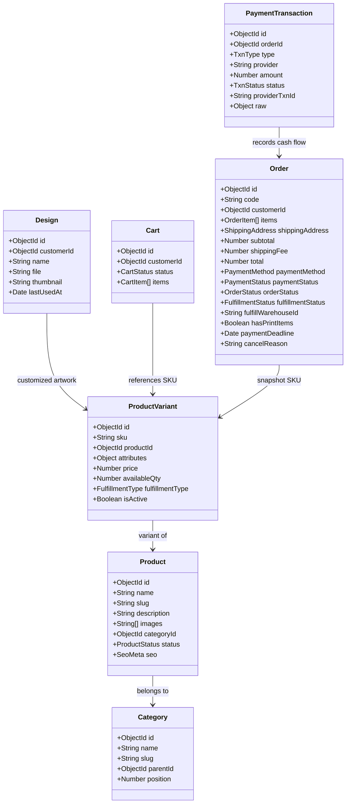
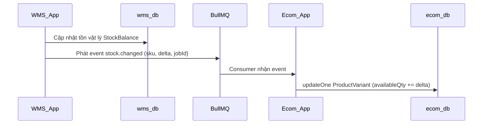
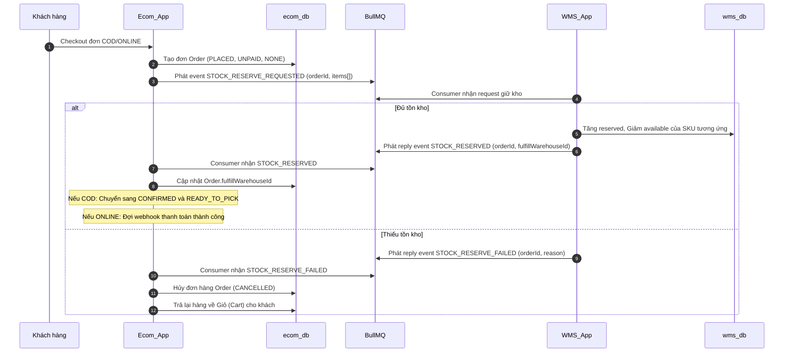
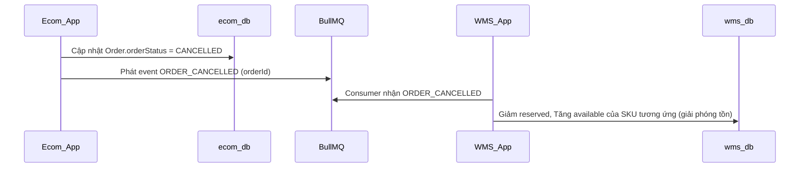

# Tài Liệu Đặc Tả API Ecommerce (Không bao gồm Auth)

Tài liệu này đặc tả toàn bộ hệ thống API phục vụ cho ứng dụng Ecommerce (đầu cuối bán hàng) và các APIs quản trị tương ứng (phía Admin) của dự án `be-wms-ecom`. 

> [!NOTE]
> Tài liệu này loại bỏ các API xác thực (Auth) vì phần xác thực khách hàng (`customers`) và nhân viên (`users`) đã hoàn thiện.
> Mọi API bên dưới tuân thủ nguyên tắc kiến trúc **DB-per-app (tách biệt `ecom_db` và `wms_db`)** và giao tiếp bất đồng bộ qua **BullMQ/Redis (`libs/events`)**, không gọi chéo trực tiếp database hay REST API chéo.

---

## 📌 Nguyên Tắc Thiết Kế Chung

### 1. Phân Tách Đường Dẫn (Routing Prefix)
- **Storefront (Khách hàng):** Prefix bắt buộc là `/api/shop/...`
- **Back-office (Admin Ecom):** Prefix bắt buộc là `/api/shop/admin/...`

### 2. Định Dạng Response Chuẩn (DTO Conventions)
Mỗi endpoint bắt buộc sử dụng 2 DTO riêng biệt: **Request DTO** (Dùng class-validator validate đầu vào) và **Response DTO** (Dùng class-transformer định dạng đầu ra và ẩn thông tin nhạy cảm).
- Mọi trường `_id` từ MongoDB/Mongoose phải được map thành `id` (kiểu string) trong Response DTO.
- Không bao giờ trả về trực tiếp Mongoose Document thô. Sử dụng `plainToInstance` với tùy chọn `{ excludeExtraneousValues: true }` tại Controller.
- Không được trả ra các trường nhạy cảm như `passwordHash`, `deletedAt`, `__v`.

### 3. Xử Lý Lỗi (Exception Handling)
- Trong các **Service (`*.service.ts`)**, cấm throw trực tiếp các NestJS Exception thô (như `BadRequestException`). Phải sử dụng `AppException` với các mã lỗi (Error Code) ổn định để Client có thể xử lý switch-case dịch nghĩa.
- Mã lỗi chung nằm ở `libs/common/src/errors/error-codes.ts`.
- Mã lỗi nghiệp vụ Ecommerce nằm ở `apps/ecommerce/src/common/error-codes.ts` (`ECOM_ERRORS`).

---

## 🗄️ Cấu Trúc MongoDB Schema Phía Ecommerce (`ecom_db`)

Dữ liệu được lưu trữ trong Database độc lập `ecom_db`, liên kết duy nhất với WMS qua trường `sku`. Mongoose tự động áp schema khi ứng dụng khởi động (không cần migrate).



---

## 1. Phân Hệ Danh Mục & Sản Phẩm (Catalog Module)

Phân hệ Catalog cung cấp các API duyệt sản phẩm công khai dành cho khách hàng, và các API quản trị sản phẩm dành cho admin/manager.

### 👥 APIs Công Khai (Public Storefront)
*Không yêu cầu Authentication.*

#### 1.1 Lấy cây danh mục sản phẩm
- **Endpoint:** `GET /api/shop/catalog/categories`
- **Query Params:**
  - `parentId` (String, optional): ID của danh mục chi tiết. Truyền giá trị `"root"` để lấy danh mục cấp cao nhất (gốc).
- **Mô tả:** Lấy danh sách các danh mục sản phẩm được sắp xếp theo trường `position` tăng dần. Hỗ trợ hiển thị cấu trúc cây đa cấp.
- **Mã lỗi có thể gặp:** `VALIDATION_FAILED` (nếu định dạng ID không đúng).

#### 1.2 Danh sách sản phẩm
- **Endpoint:** `GET /api/shop/catalog/products`
- **Query Params:**
  - `q` (String, optional): Từ khóa tìm kiếm theo tên sản phẩm (không phân biệt hoa thường).
  - `categoryId` (String, optional): Lọc theo ID danh mục.
  - `minPrice` (Number, optional): Lọc giá tối thiểu.
  - `maxPrice` (Number, optional): Lọc giá tối đa.
  - `inStock` (Boolean, optional): Chỉ lấy sản phẩm còn hàng (`availableQty > 0` đối với ít nhất 1 biến thể).
- **Mô tả:** Trả về danh sách sản phẩm có trạng thái `status: 'ACTIVE'`. Nếu lọc theo giá hoặc tình trạng tồn kho, hệ thống sẽ thực hiện join ngầm với bảng `product_variants`.

#### 1.3 Chi tiết sản phẩm kèm các biến thể (Variants)
- **Endpoint:** `GET /api/shop/catalog/products/:slug`
- **Mô tả:** Lấy thông tin chi tiết của một sản phẩm dựa trên `slug` cùng với danh sách toàn bộ các biến thể (`variants`) đang hoạt động (`isActive: true`) của sản phẩm đó.
- **Mã lỗi có thể gặp:** `ECOM_PRODUCT_NOT_FOUND` (HTTP 404 - Sản phẩm không tồn tại hoặc bị ẩn).

---

### 🛡️ APIs Quản Trị (Admin Catalog)
*Yêu cầu JWT Token hợp lệ của nhân viên và Claim `type === 'admin'` trong JWT payload (Role `ECOM_MANAGER`).*

#### 1.4 [Admin] Tạo danh mục mới
- **Endpoint:** `POST /api/shop/admin/catalog/categories`
- **Body:**
  ```json
  {
    "name": "Ly nhựa in hình",
    "slug": "ly-nhua-in-hinh",
    "parentId": "64abc... (optional)",
    "position": 1
  }
  ```
- **Mô tả:** Tạo danh mục mới phục vụ phân loại sản phẩm. Yêu cầu `slug` độc nhất và theo định dạng kebab-case.
- **Mã lỗi:** `ECOM_CATEGORY_SLUG_DUPLICATE` (Nếu slug bị trùng).

#### 1.5 [Admin] Cập nhật danh mục
- **Endpoint:** `PATCH /api/shop/admin/catalog/categories/:id`
- **Body:** `UpdateCategoryDto` (Partial của CreateCategoryDto)

#### 1.6 [Admin] Xóa danh mục
- **Endpoint:** `DELETE /api/shop/admin/catalog/categories/:id`
- **Mô tả:** Xóa danh mục sản phẩm (sẽ soft-delete bằng cách đánh dấu hoặc từ chối xóa nếu có sản phẩm đang thuộc danh mục này).

#### 1.7 [Admin] Tạo sản phẩm mới
- **Endpoint:** `POST /api/shop/admin/catalog/products`
- **Body:**
  ```json
  {
    "name": "Ly nhựa PP cao cấp",
    "slug": "ly-nhua-pp-cao-cap",
    "description": "Ly nhựa PP dùng một lần bền dẻo...",
    "images": ["https://storage.com/img1.png"],
    "categoryId": "64abc...",
    "status": "DRAFT",
    "seo": {
      "title": "Ly nhựa PP cao cấp giá sỉ",
      "description": "Mua ly nhựa PP chất lượng cao...",
      "keywords": ["ly nhua pp", "ly gia si"]
    }
  }
  ```
- **Mô tả:** Tạo sản phẩm mới ở trạng thái bản nháp (`DRAFT`). Sản phẩm này chưa xuất hiện trên storefront công khai cho đến khi được publish.

#### 1.8 [Admin] Cập nhật thông tin sản phẩm
- **Endpoint:** `PATCH /api/shop/admin/catalog/products/:id`

#### 1.9 [Admin] Đưa sản phẩm lên kệ (Publish)
- **Endpoint:** `PUT /api/shop/admin/catalog/products/:id/publish`
- **Mô tả:** Thay đổi trạng thái sản phẩm từ `DRAFT` hoặc `HIDDEN` thành `ACTIVE`.

#### 1.10 [Admin] Tạo biến thể sản phẩm (Variant)
- **Endpoint:** `POST /api/shop/admin/catalog/variants`
- **Body:**
  ```json
  {
    "sku": "CUP-PP-350ML",
    "productId": "64abc...",
    "price": 12000,
    "attributes": {
      "size": "350ml",
      "material": "PP"
    },
    "fulfillmentType": "STANDARD" // STANDARD | PRINTED_TEMPLATE | CUSTOM_PRINT
  }
  ```
- **Mô tả:** Tạo biến thể mới cho một sản phẩm, ánh xạ trực tiếp đến một mã SKU trong WMS. 
- **Quy tắc về `fulfillmentType`:**
  - `STANDARD`: Hàng thông thường bán ngay tại kho.
  - `PRINTED_TEMPLATE`: Ly in sẵn theo mẫu của shop.
  - `CUSTOM_PRINT`: Hàng in ấn theo yêu cầu của khách hàng (yêu cầu thiết kế và trả trước online).

#### 1.11 [Admin] Cập nhật biến thể sản phẩm
- **Endpoint:** `PATCH /api/shop/admin/catalog/variants/:id`

---

## 2. Phân Hệ Thư Viện Thiết Kế (Design Module)

Cho phép khách hàng lưu trữ và quản lý các tác phẩm nghệ thuật (artwork) tải lên của họ để phục vụ in ấn theo yêu cầu.

*Yêu cầu JWT Token Khách Hàng (Customer).*

#### 2.1 Lấy danh sách thiết kế cá nhân
- **Endpoint:** `GET /api/shop/designs`
- **Mô tả:** Trả về danh sách các file thiết kế của chính khách hàng đăng nhập, được sắp xếp theo thời gian sử dụng gần nhất (`lastUsedAt` giảm dần) để dễ dàng tái sử dụng trong các đơn hàng mới.

#### 2.2 Thêm thiết kế mới vào thư viện
- **Endpoint:** `POST /api/shop/designs`
- **Body:**
  ```json
  {
    "name": "Thiết kế cốc cưới Minh - Lan",
    "file": "https://storage.com/designs/marriage-cup.png",
    "thumbnail": "https://storage.com/thumbnails/marriage-cup.jpg"
  }
  ```
- **Mô tả:** Lưu lại liên kết URL file thiết kế (đã upload thành công lên cloud storage) vào thư viện cá nhân.

#### 2.3 Xóa thiết kế
- **Endpoint:** `DELETE /api/shop/designs/:id`
- **Mô tả:** Chỉ cho phép khách hàng tự xóa thiết kế do chính họ sở hữu.
- **Mã lỗi:** `ECOM_DESIGN_NOT_FOUND` hoặc `ECOM_FORBIDDEN_DESIGN_OWNERSHIP` (Nếu không có quyền xóa).

---

## 3. Phân Hệ Giỏ Hàng (Cart Module)

*Yêu cầu JWT Token Khách Hàng (Customer).*

Giỏ hàng được lưu trữ trong Database (`carts` collection) của `ecom_db` để duy trì phiên mua sắm giữa các thiết bị. Giỏ hàng **chưa thực hiện giữ tồn kho** của sản phẩm mà chỉ hiển thị cảnh báo dựa trên trường `availableQty` (bản copy).

#### 3.1 Xem thông tin giỏ hàng hiện tại
- **Endpoint:** `GET /api/shop/cart`
- **Mô tả:** Trả về giỏ hàng đang hoạt động (`status: 'ACTIVE'`) của khách hàng kèm danh sách các mặt hàng, giá cả và tồn kho hiện hữu của từng SKU. Nếu chưa có giỏ hàng hoạt động nào, hệ thống tự tạo mới một giỏ trống và trả về.

#### 3.2 Thêm sản phẩm vào giỏ hàng
- **Endpoint:** `POST /api/shop/cart/items`
- **Body:**
  ```json
  {
    "sku": "CUP-PP-350ML",
    "quantity": 2,
    "designId": "64abc... (optional)",
    "designFile": "https://storage.com/designs/marriage-cup.png (optional)"
  }
  ```
- **Quy tắc Nghiệp Vụ:**
  - Nếu SKU không hợp lệ hoặc đã dừng bán (`isActive: false`), trả về lỗi `ECOM_PRODUCT_VARIANT_NOT_AVAILABLE`.
  - Nếu biến thể đó có `fulfillmentType` là `CUSTOM_PRINT` (in theo yêu cầu), trường `designFile` (URL ảnh gốc) là **bắt buộc**.
  - Nếu có truyền `designId`, hệ thống kiểm tra quyền sở hữu thiết kế đó và thực hiện cập nhật trường `lastUsedAt` của thiết kế sang thời gian hiện tại.

#### 3.3 Cập nhật số lượng sản phẩm trong giỏ
- **Endpoint:** `PUT /api/shop/cart/items/:sku`
- **Body:**
  ```json
  {
    "quantity": 5
  }
  ```
- **Mô tả:** Thay đổi trực tiếp số lượng đặt mua của một SKU trong giỏ.

#### 3.4 Xóa một mặt hàng khỏi giỏ
- **Endpoint:** `DELETE /api/shop/cart/items/:sku`

#### 3.5 Làm trống giỏ hàng
- **Endpoint:** `DELETE /api/shop/cart`

---

## 4. Phân Hệ Đặt Hàng & Thanh Toán (Order & Payment Module)

Phân hệ này kiểm soát luồng tạo đơn hàng, chạy Saga kiểm tra tồn kho nguồn thật bên WMS, thực hiện hủy đơn tự động và xử lý cổng thanh toán trực tuyến.

### 📦 APIs Đơn Hàng (Order Controller)
*Yêu cầu JWT Token Khách Hàng (Customer).*

#### 4.1 Đặt hàng từ giỏ (Checkout)
- **Endpoint:** `POST /api/shop/orders/checkout`
- **Body:**
  ```json
  {
    "addressId": "64abc... (ID địa chỉ nhận hàng của khách)",
    "paymentMethod": "COD" // COD | ONLINE
  }
  ```
- **Quy tắc và Luồng Xử Lý:**
  1. Lấy thông tin giỏ hàng `ACTIVE` hiện tại. Kiểm tra nếu giỏ trống thì báo lỗi `ECOM_CART_EMPTY`.
  2. **Kiểm tra nghiệp vụ ly in:** Nếu giỏ hàng chứa ít nhất một sản phẩm in theo yêu cầu (`isPrintItem: true`), phương thức thanh toán **bắt buộc phải là ONLINE**. Nếu chọn `COD` sẽ bị từ chối bằng lỗi `ECOM_PRINT_ITEM_REQUIRES_PREPAYMENT`.
  3. Tính tổng tiền đơn hàng (v1 mặc định miễn phí ship).
  4. Lấy chi tiết địa chỉ nhận hàng từ danh bạ địa chỉ của khách hàng (sẽ ném lỗi nếu không khớp).
  5. Đơn hàng ONLINE sẽ được tính toán một thời hạn thanh toán (`paymentDeadline` - mặc định 30 phút từ lúc đặt).
  6. Tạo bản ghi đơn hàng mới (`Order`) ở trạng thái khởi tạo:
     - `orderStatus: 'PLACED'`
     - `paymentStatus: 'UNPAID'`
     - `fulfillmentStatus: 'NONE'`
  7. **Chạy Saga giữ tồn kho:** Phát sự kiện `STOCK_RESERVE_REQUESTED` sang WMS để khóa tồn kho vật lý tại `wms_db.stock_balances` (chi tiết ở mục Luồng Event).
  8. Nếu đơn hàng sử dụng phương thức `ONLINE`, hệ thống sẽ thiết lập một delayed job BullMQ tự động hủy đơn sau 30 phút nếu trạng thái thanh toán vẫn là `UNPAID`.
- **Mã phản hồi thành công:** Trả về đối tượng `Order` vừa khởi tạo.

#### 4.2 Danh sách đơn hàng cá nhân
- **Endpoint:** `GET /api/shop/orders`
- **Mô tả:** Trả về danh sách lịch sử toàn bộ đơn hàng của khách hàng hiện tại, sắp xếp theo thời gian tạo mới nhất.

#### 4.3 Chi tiết một đơn hàng
- **Endpoint:** `GET /api/shop/orders/:id`
- **Mô tả:** Trả về chi tiết đơn hàng, bao gồm 3 trục trạng thái hiện tại (`orderStatus`, `paymentStatus`, `fulfillmentStatus`), thông tin giao hàng và chi tiết các mặt hàng.
- **Mã lỗi:** `ECOM_ORDER_NOT_FOUND` (Nếu ID không đúng hoặc không thuộc quyền sở hữu).

#### 4.4 Hủy đơn hàng
- **Endpoint:** `POST /api/shop/orders/:id/cancel`
- **Body:**
  ```json
  {
    "reason": "Tôi muốn đổi địa điểm giao hàng"
  }
  ```
- **Quy tắc Nghiệp Vụ:**
  - Chỉ cho phép hủy đơn khi trạng thái giao vận chưa được đóng gói xuất kho (trước trạng thái `ISSUED` đối với hàng thường).
  - Đối với đơn hàng có ly in custom (`isPrintItem: true`), chỉ cho phép hủy đơn trước khi lệnh in được đưa xuống phân xưởng in (trước trạng thái `AWAITING_PRINT`).
  - Khi hủy thành công, hệ thống cập nhật `orderStatus: 'CANCELLED'` và phát sự kiện `ORDER_CANCELLED` sang WMS để giải phóng tồn kho đã khóa trước đó.
  - Nếu đơn hàng đã thanh toán thành công (`paymentStatus: 'PAID'`), hệ thống chuyển trạng thái thanh toán sang `REFUND_PENDING` để kích hoạt nghiệp vụ hoàn tiền.

#### 4.5 Hoàn trả hàng (RMA)
- **Endpoint:** `POST /api/shop/orders/:id/return`
- **Mô tả:** Yêu cầu hoàn trả hàng sau khi giao thành công.
- **Quy tắc Nghiệp Vụ:**
  - Chỉ áp dụng đối với đơn hàng có trạng thái giao nhận là `DELIVERED`.
  - Thời hạn gửi yêu cầu hoàn trả tối đa là **7 ngày** kể từ thời điểm giao thành công (`updatedAt` của trạng thái DELIVERED).
  - Sản phẩm in custom (`isPrintItem: true`) **không áp dụng** chính sách hoàn trả này.
  - Khi được chấp nhận, hệ thống chuyển `fulfillmentStatus: 'RETURNED'` và gửi sự kiện `ORDER_RETURNED` sang WMS để xử lý nhập kho hoàn trả.

---

### 💳 APIs Cổng Thanh Toán (Payment Controller)

#### 4.6 Lấy URL cổng thanh toán VNPay
- **Endpoint:** `GET /api/shop/payment/vnpay/create-url/:orderId`
- **Quyền truy cập:** Khách hàng (Đã xác thực).
- **Mô tả:** Tạo link redirect sang cổng sandbox VNPay để thanh toán cho đơn hàng có phương thức `ONLINE`.
- **Mã lỗi:** `ECOM_ORDER_ALREADY_PAID` (Đơn đã thanh toán), `ECOM_ORDER_NOT_ONLINE_PAYMENT` (Đơn không hỗ trợ trả online).

#### 4.7 VNPay IPN Webhook (Server-to-Server)
- **Endpoint:** `GET /api/shop/payment/vnpay/ipn`
- **Quyền truy cập:** Công khai (VNPay gọi trực tiếp từ hệ thống của họ).
- **Mô tả:** Nhận kết quả thanh toán trực tiếp từ VNPay. Hệ thống thực hiện xác thực chữ ký số HMAC-SHA512.
- **Tính Idempotency (Chống ghi trùng):** Sử dụng mã giao dịch từ VNPay (`vnp_TransactionNo`) làm khóa duy nhất (`providerTxnId @unique index` trong bảng `payment_transactions`). Nếu VNPay gửi trùng webhook IPN, hệ thống sẽ bỏ qua và trả về phản hồi thành công lập tức mà không cộng dồn tiền hay chạy lại logic nghiệp vụ.
- **Kết quả trả về:** Dạng JSON chuẩn theo tài liệu VNPay: `{ "RspCode": "00", "Message": "success" }`.

#### 4.8 VNPay Redirect Return Page
- **Endpoint:** `GET /api/shop/payment/vnpay/return`
- **Mô tả:** Nơi VNPay redirect trình duyệt của khách hàng về sau khi thanh toán xong. API phân tích kết quả và trả về trạng thái dạng JSON (`{ success: true/false, orderCode: "..." }`) để Client hiển thị UI thông báo.

---

## 🔄 Hệ Thống Event Đồng Bộ & Luồng Saga Bất Đồng Bộ

Để đảm bảo tính độc lập dữ liệu giữa Ecommerce (`ecom_db`) và WMS (`wms_db`), các hành động xuyên suốt hệ thống sẽ dựa trên các Worker BullMQ thuộc `libs/events` để đồng bộ hóa.

### 1. Đồng Bộ Tồn Kho (Stock Updates Flow)
Khi có sự thay đổi tồn kho vật lý tại WMS (Nhập kho mới, kiểm kho phát hiện lệch, hàng hết hạn sử dụng...):



- **Consumer Idempotency:** Ecom_App sử dụng bảng `ProcessedEvent` lưu lại cặp `(jobId, eventName)` đã xử lý trong một transaction cục bộ để tránh trừ hoặc cộng dồn tồn kho trùng lặp khi BullMQ thực hiện retry.

### 2. Saga Đặt Hàng (Checkout Stock Reservation Saga)
Được kích hoạt ngay khi khách hàng gửi yêu cầu checkout.



### 3. Saga Giải Phóng Tồn Kho Khi Hủy Đơn (Cancel Order Saga)
Khi đơn hàng bị hủy (khách tự hủy, hoặc quá hạn thanh toán 30 phút):



### 4. Luồng Chuyển Trạng Thái Giao Hàng (Fulfillment Flow)
Khi đơn hàng được xác nhận đủ điều kiện thực thi (COD xác nhận giữ tồn thành công hoặc ONLINE đã xác nhận thanh toán `PAID`):

- **Bước 4.1:** Ecom phát sự kiện nghiệp vụ:
  - Nếu đơn không có ly in: Phát `ORDER_READY_TO_FULFILL` gửi sang WMS để tiến hành đóng gói (Pick/Pack).
  - Nếu đơn có ly in: Phát `PRINT_REQUESTED` sang WMS kèm theo liên kết chứa file thiết kế (`designFile`) của khách.
- **Bước 4.2:** Sau khi xưởng in WMS in xong ly:
  - WMS phát sự kiện `PRINT_COMPLETED` (kèm `printJobId`).
  - Ecom nhận sự kiện này, gán `printJobId` vào đơn hàng để lưu lịch sử, chuyển đơn sang `READY_TO_PICK` và phát tiếp `ORDER_READY_TO_FULFILL` để yêu cầu kho xuất hàng đi.
- **Bước 4.3:** Khi WMS thực hiện đóng gói xuất kho thật:
  - WMS phát sự kiện `GOODS_ISSUED` (kèm `goodsIssueId`).
  - Ecom nhận sự kiện và cập nhật `fulfillmentStatus` của đơn hàng sang `ISSUED`.
- **Bước 4.4:** Khi hãng vận chuyển thực hiện giao vận:
  - Khi hãng đến kho lấy hàng: WMS cập nhật Shipment -> Phát `SHIPMENT_SHIPPED` -> Ecom cập nhật đơn hàng thành `SHIPPED`.
  - Khi giao hàng thành công: WMS cập nhật Shipment -> Phát `SHIPMENT_DELIVERED` -> Ecom cập nhật đơn hàng thành `DELIVERED` đồng thời đóng đơn hàng (`orderStatus: 'CLOSED'`).
  - Nếu là COD, Ecom cũng cập nhật trạng thái thanh toán sang `PAID`.
